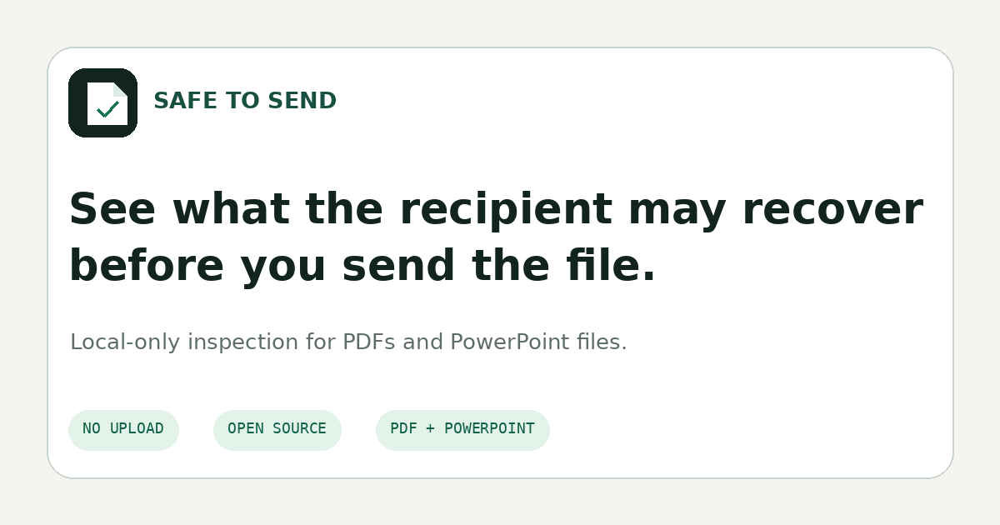

<p align="center">
  
</p>

<h1 align="center">Safe to Send</h1>

<p align="center"><strong>Inspect PDFs and PowerPoint files for hidden, recoverable, or private content before sharing.</strong></p>

<p align="center">
  <a href="https://hassanalshama.github.io/safe-to-send/">Open the scanner</a> ·
  <a href="https://hassanalshama.github.io/safe-to-send/methodology.html">Methodology</a> ·
  <a href="https://hassanalshama.github.io/safe-to-send/cli.html">CLI</a>
</p>

<p align="center">
  <a href="https://github.com/hassanalshama/safe-to-send/actions/workflows/ci.yml"></a>
  <a href="https://www.npmjs.com/package/safe-to-send"></a>
  <a href="LICENSE"></a>
  
</p>

<p align="center">
  
</p>

A presentation can look clean while still containing speaker notes, hidden slides, off-slide objects, embedded workbooks, comments, author details, local paths, or cropped image data. A PDF can display a black box while leaving the text beneath it recoverable.

Safe to Send inspects the saved file itself. The browser app performs the scan locally, with no upload, account, analytics, remote script, or network request. The same scanner core powers the CLI and deterministic test suite.

## Try it

Open the [browser scanner](https://hassanalshama.github.io/safe-to-send/), or run the CLI:

```bash
npx safe-to-send proposal.pptx
npx safe-to-send contract.pdf
```

Until the npm package is published, run directly from GitHub:

```bash
npx github:hassanalshama/safe-to-send proposal.pptx
```

Example result:

```text
DO NOT SEND YET
2 high · 4 medium · 1 low

High
- Speaker notes remain in slide 8
- Embedded workbook found in slide 11
```

The repository includes intentionally unsafe and clean sample files under [`examples/`](examples/) so every major claim can be reproduced without using a sensitive document.

## What it checks

### PowerPoint

| Area | Examples |
|---|---|
| Concealed content | Speaker notes, hidden slides, hidden objects, off-slide objects, orphaned notes |
| Embedded material | Documents, spreadsheets, OLE objects, packages, custom XML |
| Active content | VBA projects, macro/extension mismatch, external relationships |
| Review data | Comments, authors, custom properties, revision-related parts |
| Images | Cropped-image remnants, EXIF/XMP/IPTC metadata, local source paths |
| Package integrity | CRC failures, unsafe paths, duplicate entries, encryption, decompression limits |
| Sensitive values | Credential-like assignments, private keys, tokens, internal URLs, email addresses, IBANs, payment-card patterns found in concealed content |

### PDF

| Area | Examples |
|---|---|
| Redaction failures | Recoverable text geometrically covered by an opaque rectangle |
| Invisible content | Non-painting text, clipped text, off-page text, optional-content layers |
| Interactive content | JavaScript, launch actions, open actions, forms, annotations |
| Embedded material | File attachments and embedded-file name trees |
| Document history | Incremental updates and earlier revision markers |
| Metadata | Author, creator application, producer, subject, keywords |
| Coverage | Encryption, malformed structure, unsupported stream filters, decoding limits |

The complete rule behavior, severity model, and known limits are documented in [Methodology](methodology.html) and [`THREAT_MODEL.md`](THREAT_MODEL.md).

## Browser privacy boundary

The public app is static. It has no backend. Its Content Security Policy contains:

```text
connect-src 'none'
```

That prevents the page from opening network connections through `fetch`, XHR, WebSocket, EventSource, or related browser APIs. Files are read into a dedicated worker and results stay in memory unless the user explicitly downloads a report.

The CLI also performs no network access. No telemetry is included anywhere in the repository.

## Reports

Each finding includes:

- Stable rule ID
- Severity and confidence
- Exact location
- Evidence excerpt
- Practical remediation
- Machine-readable metadata

Available output formats:

```bash
safe-to-send file.pptx --format text
safe-to-send file.pptx --format json --output report.json
safe-to-send file.pptx --format markdown --output report.md
safe-to-send file.pptx --format html --output report.html
safe-to-send release/ --recursive --format sarif --output safe-to-send.sarif
```

The versioned JSON schema is in [`docs/report-schema.json`](docs/report-schema.json).

### Exit codes

| Code | Meaning |
|---:|---|
| `0` | Scan completed and no finding met `--fail-on` |
| `1` | Input, argument, or scanner execution error |
| `2` | A finding met `--fail-on` |
| `3` | Scan coverage was incomplete and no finding met `--fail-on` |

The default threshold is `high`.

## GitHub Action

Use the repository directly as a composite action:

```yaml
name: Document privacy check

on:
  pull_request:
    paths:
      - "deliverables/**"

jobs:
  scan:
    runs-on: ubuntu-latest
    permissions:
      contents: read
    steps:
      - uses: actions/checkout@v7
      - uses: hassanalshama/safe-to-send@v0
        with:
          path: deliverables
          recursive: "true"
          fail-on: high
          report: safe-to-send.sarif
```

The action fails the job when the selected threshold is met and always writes the SARIF report before exiting.

Before the first tagged release, use `hassanalshama/safe-to-send@main`. After publishing version `0.x`, create or move the major tag `v0` to the released commit.

## Command-line reference

```text
safe-to-send [options] <file-or-directory> [...]
cat document.pdf | safe-to-send --stdin-name document.pdf -

-f, --format <name>       text, json, markdown, html, or sarif
-o, --output <path>       write output to a file
-r, --recursive           scan supported files inside directories recursively
    --fail-on <severity>  high, medium, low, info, or never
    --max-size <value>    per-file limit, such as 100MB or 1GB
    --stdin-name <name>   filename used when reading standard input
    --no-color            disable terminal colors
-q, --quiet               print only the verdict line in text mode
```

Supported extensions: `.pdf`, `.pptx`, `.pptm`, `.ppsx`, `.ppsm`, `.potx`, and `.potm`.

## Design constraints

Safe to Send deliberately favors a small, auditable attack surface:

- Zero runtime dependencies
- No file upload or server component
- No remote model or heuristic service
- Bounded archive entry count, decompressed size, stream size, and nesting behavior
- CRC-32 verification for ZIP entries
- Deterministic finding identifiers and fixtures
- Coverage failures block reassuring verdicts
- No automatic sanitization in the first release

Automatic cleaning is excluded because silently corrupting a file or claiming complete removal would be worse than reporting a risk. The scanner identifies evidence and directs the user to create and inspect a reviewed copy.

## Limitations

A result is evidence, not proof that a document is safe.

Safe to Send can miss content when a file is encrypted, malformed, uses unsupported encodings or filters, depends on application-specific behavior, stores information in an unrecognized extension, or uses a concealment technique not represented by current rules. False positives are also possible, especially in geometry-based PDF redaction detection and sensitive-value pattern matching.

Use the source application’s own inspection tools as a separate control. For high-consequence disclosures, use a documented review process and verify the final file manually in more than one viewer.

Do not submit real secrets or confidential documents as public bug reports. See [`SECURITY.md`](SECURITY.md).

## Development

Requirements: Node.js 20 or newer. No package installation is required for normal development.

```bash
git clone https://github.com/hassanalshama/safe-to-send.git
cd safe-to-send
npm run verify
npm run dev
```

`npm run verify` regenerates deterministic fixtures, validates source and local links, runs the test suite, builds the static site, scans the release fixtures, and dry-runs the npm package.

Repository layout:

```text
core/          scanner, archive parser, report model, renderers
cli/           command-line interface
tests/         deterministic unit and integration tests
examples/      generated clean and intentionally unsafe fixtures
scripts/       fixture generator, build, checks, local server
.github/       CI, Pages, security, release, and issue workflows
```

Read [`CONTRIBUTING.md`](CONTRIBUTING.md) before proposing a new rule. A useful detector needs a minimal fixture, a clean counterexample, deterministic evidence, a documented limit, and tests for both detection and non-detection.

## Security

Report scanner vulnerabilities privately through GitHub Security Advisories. Do not open a public issue containing an exploit, a sensitive document, or recovered confidential material. See [`SECURITY.md`](SECURITY.md).

## License

Apache License 2.0. See [`LICENSE`](LICENSE) and [`NOTICE`](NOTICE).
